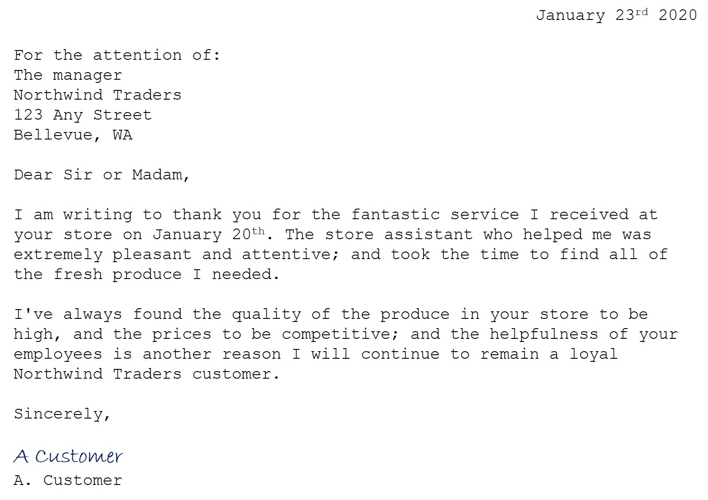

---
lab:
  title: 在 Vision Studio 中讀取文字
---

# 在 Vision Studio 中讀取文字

在本練習中，您將使用 Azure AI 服務來探索 Azure AI 視覺的光學字元辨識功能。 您將使用 Vision Studio 來實驗從影像中擷取文字，而無需撰寫任何程式碼。

常見的電腦視覺挑戰是偵測和解譯內嵌在影像中的文字。 這稱為光學字元辨識 (OCR)。 在本練習中，您將使用 Azure AI 服務資源，其中包括 Azure AI 視覺服務。 然後，您將使用 Vision Studio 來嘗試對不同類型的影像進行 OCR。

## 建立 *Azure AI 服務*資源

您可以透過 **Azure AI 服務**的多服務資源來使用 Azure AI 視覺的 OCR 功能。 如果您尚未建立此資源，請在 Azure 訂閱中建立 **Azure AI 服務**資源。

1. 在另一個瀏覽器索引標籤中，開啟 **Azure 入口網站** (位於 [https://portal.azure.com](https://portal.azure.com?azure-portal=true))，並使用與您的 Azure 訂用帳戶相關聯的 Microsoft 帳戶登入。

1. 按一下 **＋建立資源 **按鈕並搜尋  * Azure AI 服務 *。 選取**建立** **Azure AI 服務**方案。 系統會帶您前往建立 Azure AI 服務資源的頁面。 使用下列設定對其進行設定：
    - **訂用帳戶**：*您的 Azure 訂用帳戶*。
    - **資源群組**：*選取或建立具有唯一名稱的資源群組*。
    - **區域**：*選取最接近的地理區域。如果在美國東部，請使用 "East US 2"*。
    - **名稱**：*輸入唯一名稱*。
    - **定價層**：*標準 S0。*
    - **核取此方塊即表示我確認我已閱讀並了解下列所有條款**：*已選取*。

1. 選取 [檢閱 + 建立]****，然後再選取 [建立]**** 並等待部署完成。

## 將您的 Azure AI 服務資源連線至 Vision Studio

接下來，將上面您已佈建的 Azure AI 服務資源連線到 Vision Studio。

1. 在另一個瀏覽器索引標籤中，瀏覽至 **Vision Studio** (位於 [https://portal.vision.cognitive.azure.com](https://portal.vision.cognitive.azure.com?azure-portal=true))。

1. 使用您的帳戶登入，並確保使用與建立 Azure AI 服務資源的目錄相同的目錄。

1. 在 [Vision Studio] 首頁上，選取 [開始使用視覺]**** 標題底下的 [檢視所有資源]****。

    ![在 Vision Studio 中的 [開始使用視覺] 底下，[檢視所有資源] 連結會反白顯示。](./media/analyze-images-vision/vision-resources.png)

1. 在 [選取要使用的資源]**** 頁面上，將滑鼠游標停留在您在清單中上面所建立的資源上，並核取資源名稱左邊的方塊，然後選取 [選取為預設資源]****。

    > **備註**：如果未列出您的資源，您可能需要**重新整理**頁面。

    ![即會顯示 [選取要使用的資源] 對話方塊，其中反白顯示並核取了 cog-ms-learn-vision-SUFFIX 認知服務資源。 [選取為預設資源] 按鈕會反白顯示。](./media/analyze-images-vision/default-resource.png)

1. 選取畫面右上方的 "x" 以關閉設定頁面。

## 在 Vision Studio 中從影像中擷取文字
    
1. 在網頁瀏覽器中，瀏覽至 **Vision Studio** (位於 [https://portal.vision.cognitive.azure.com](https://portal.vision.cognitive.azure.com?azure-portal=true))。

1. 在 [開始使用視覺]**** 登陸頁面上，選取 [光學字元辨識]****，然後選取 [從影像中擷取文字]**** 磚。

1. 在 [試用]**** 子標題下，閱讀並核取方塊來確認資源使用原則。  

1. 選取 [**https://aka.ms/mslearn-ocr-images**](https://aka.ms/mslearn-ocr-images) 以下載 **ocr-images.zip**。 然後開啟資料夾。

1. 在入口網站上，選取 [瀏覽以找到檔案]****，然後瀏覽至您的電腦上下載 **ocr-images.zip** 的資料夾。 選取 **advert.jpg**，然後選取 [開啟]****。

1. 現在，請檢閱傳回的內容：
    - 在 [偵測到的屬性]**** 中，影像中找到的任何文字都會被組織成區域、行和單字的階層式結構。
    - 在影像上，文字的位置會以周框方塊表示，如下所示：

    

1. 您現在可以嘗試另一個影像。 選取 [瀏覽以找到檔案]****，然後瀏覽至您儲存來自 GitHub 的檔案的資料夾。 選取 **letter.jpg**。

    

1. 檢閱第二個影像的結果。 它應該會傳回文字和文字的周框方塊。 如果您有時間，請嘗試 **note.jpg** 和 **receipt.jpg**。

## 清理

如果您不打算進行更多的練習，請刪除不再需要的任何資源。 這可以避免產生任何不必要的成本。

1. 開啟 **Azure 入口網站** (位於 [https://portal.azure.com](https://portal.azure.com?azure-portal=true))，然後選取包含您所建立資源的資源群組。
1. 選取資源並選取 [刪除]****，然後再選取 [是]**** 以確認。 接著即會刪除該資源。

## 深入了解

若要深入了解可以使用此服務執行哪些作業，請參閱 Azure AI 視覺有關[光學字元辨識](https://learn.microsoft.com/azure/ai-services/computer-vision/overview-ocr)的文件。
