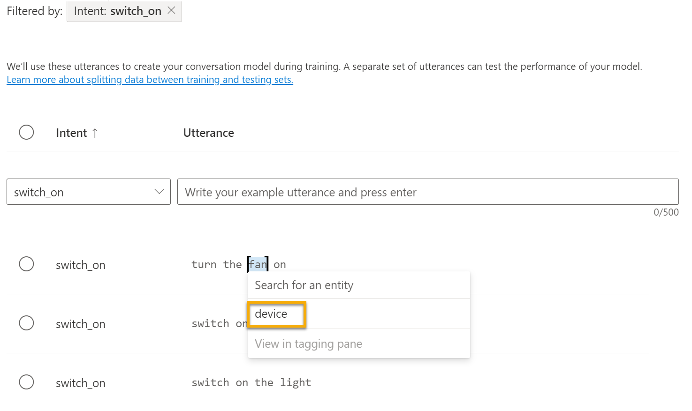

---
lab:
  title: 搭配 Language Studio 使用交談語言理解
---

# 搭配 Language Studio 使用交談語言理解

我們日漸期待電腦能夠使用 AI，以便理解口說或打字輸入的自然語言命令。 例如，您可能想要家庭自動化系統來控制家裡的裝置，例如使用語音命令「開啟燈光」或「將風扇開啟」。 AI 支援的裝置可以了解這些命令，並採取適當的動作。

在此練習中，您將使用 Language Studio 來建立及測試專案，以將指示傳送給燈光或風扇等裝置。 您將使用交談語言理解服務的功能來設定專案。 

## 建立*語言*資源

您可以使用許多 Azure AI 語言功能搭配**語言**或 **Azure AI 服務**資源。 有一些執行個體只能使用語言資源。 針對下列練習，我們將使用**語言**資源。 如果您尚未建立此資源，請在 Azure 訂用帳戶中建立 [語言]**** 資源。

1. 在另一個瀏覽器索引標籤中，開啟位於 [https://portal.azure.com](https://portal.azure.com?azure-portal=true) 的 Azure 入口網站，並使用與您的 Azure 訂用帳戶相關聯的 Microsoft 帳戶登入。

1. 按一下 [&#65291;建立資源]**** 按鈕並搜尋*語言服務*。 選取 [建立]**** **語言服務**方案。 系統會帶您前往頁面，以 *選取其他功能**。 保留預設選取項目，然後按一下 [繼續]**** 以建立您的資源。 

1. 在 [建立語言]**** 頁面上，使用下列設定進行設定：
    - **訂用帳戶**：*您的 Azure 訂用帳戶*。
    - **資源群組**：*選取或建立具有唯一名稱的資源群組*。
    - **區域**：*選取最接近的地理區域。如果在美國東部，請使用 "美國東部 2"*。
    - **名稱**：*輸入唯一名稱*。
    - **定價層**：*如果無法使用免費 F0，則為免費 F0 或 S*
    - **核取此方塊即表示我確認我已閱讀並了解下列所有條款**：*已選取*。

1. 選取 [檢閱 + 建立]****，然後再選取 [建立]**** 並等待部署完成。

### 建立交談語言理解應用程式

若要實作自然語言理解與交談語言理解，請建立應用程式；然後新增實體、意圖和表達來定義您想要應用程式執行的命令。

1. 在新的瀏覽器索引標籤中，開啟位於 [https://language.azure.com](https://language.azure.com?azure-portal=true) 的 Language Studio 入口網站，然後使用與您的 Azure 訂用帳戶相關聯的 Microsoft 帳戶登入。

1. 若系統提示您選擇語言資源，請選取下列設定：
    - **Azure 目錄**：*包含您訂用帳戶的 Azure 目錄*。
    - **Azure 訂用帳戶**：您的 Azure 訂用帳戶**。
    - **語言資源**：*您先前建立的語言資源。*

   如果您***未***收到選擇語言資源的提示，可能是因為您的訂用帳戶中有多個語言資源；在此情況下：
    1. 在頁面頂端的列上，選取 [設定 (&#9881;)]****。
    2. 在 [設定]**** 分頁上，檢視 [資源]**** 索引標籤。
    3. 選取您剛才建立的語言資源，然後選取 [切換資源]****。
    4. 在頁面頂端，選取 [Language Studio]**** 以回到 Language Studio 首頁。

1. 在入口網站頂端的 [新建] **** 功能表中，選取 [交談語言理解] ****。

1. 在 [建立專案]**** 對話方塊的 [輸入基本資訊]**** 頁面上，輸入下列詳細資料，然後選取 [下一步]****：
    - **名稱**：*建立唯一的名稱*
    - **表達主要語言**：*英文*
    - **在專案中啟用多種語言**：*請勿選取*
    - **描述**：`Simple home automation`

    > **秘訣**：記下您的*專案名稱*，您稍後會使用它。

1. 在 [檢閱和完成] **** 頁面上，選取 [建立]****。

### 建立意圖、表達和實體

*意圖*是您想要執行的動作 - 例如，您可以開燈或關閉風扇。 在此情況下，您會定義兩個意圖：一個用來開啟裝置，另一個用來關閉裝置。 針對每個意圖，您會指定*表達*範例，以指出用來表示意圖的語言種類。

1. 在 [結構描述定義]**** 窗格中，確定已選取 [意圖]****。接著，選取 [新增]****、新增名稱為 `switch_on` (小寫) 的意圖，然後選取 [新增意圖]****。

    ![在 [建置結構描述] 窗格的 [意圖] 下選取 [新增]。](media/conversational-language-understanding/build-schema.png)

    ![新增 switch_on 意圖，然後選取 [新增意圖]。](media/conversational-language-understanding/add-intent.png)

1. 選取 [switch_on]**** 意圖。 其會帶您前往 [資料標籤]**** 頁面。 在 [意圖]**** 下拉式清單中，選取 [switch_on]****。 在 [switch_on]**** 意圖旁邊，輸入表達 `turn the light on`，然後按 **Enter** 鍵將此表達提交至清單。

    ![在 [表達] 下輸入 "turn the light on"，以將表達新增至定型集。](media/conversational-language-understanding/add-utterance-on.png)

1. 語言服務需要每個意圖至少有五個不同的表達範例，才能充分為語言模型定型。 為 [switch_on]**** 意圖再新增五個表達範例：  
    - `switch on the fan`
    - `put the fan on`
    - `put the light on`
    - `switch on the light`
    - `turn the fan on`

1. 在畫面右側的 [為要定型的實體加上標籤]**** 窗格上，選取 [加標籤]****，然後選取 [新增實體]****。 輸入 `device` (小寫)、選取 [清單]****，然後選取 [新增實體]****。

    ![在 [標記要定型的實體] 面板上選取 [標記] 來新增實體，然後選取 [新增實體]。](media/conversational-language-understanding/add-entity.png)

    ![在 [實體] 下輸入 device 並選取 [清單]，然後選取 [新增實體]。](media/conversational-language-understanding/add-entity-device.png)

1. 在 ***turn the fan on*** 表達中，醒目提示「fan」一字。 然後在出現的清單中，於 [搜尋實體]** 方塊中選取 [裝置]****。

    

1. 對所有表達執行相同的動作。 使用 [裝置]**** 實體為其餘的 *fan* 或 *light* 表達加上標籤。 完成時，請確認您有下列表達，並務必要選取 [儲存變更]****：

    | **意圖** | **表達** | **實體** |
    | --------------- | ------------------ | ------------------ |
    | switch_on   | Put on the fan      | 裝置 - *選取 fan* |
    | switch_on   | Put on the light    | 裝置 - *選取 light* |
    | switch_on   | Switch on the light | 裝置 - *選取 light* |
    | switch_on   | Turn the fan on     | 裝置 - *選取 fan* |
    | switch_on   | Switch on the fan   | 裝置 - *選取 fan* |
    | switch_on   | Turn the light on   | 裝置 - *選取 light* |

    ![完成後，選取 [儲存變更]。](media/conversational-language-understanding/save-changes.png) 

1. 在左側窗格中，選取 [結構描述定義]****，並確認您的 **switch_on** 意圖已列出。 然後選取 [新增]****，並新增名稱為 `switch_off` (小寫) 的新意圖。

    ![返回 [建置結構描述] 畫面，並新增 switch_off 意圖。](media/conversational-language-understanding/add-switch-off.png) 

1. 選取 [switch_off]**** 意圖。 其會帶您前往 [資料標籤]**** 頁面。 在 [意圖]**** 下拉式清單中，選取 [switch_off]****。 在 [switch_off]**** 意圖旁邊，新增表達 `turn the light off`。

1. 為 [switch_off]**** 意圖再新增五個表達範例。
    - `switch off the fan`
    - `put the fan off`
    - `put the light off`
    - `turn off the light`
    - `switch the fan off`

1. 使用 [裝置]**** 實體為 *light* 或 *fan* 一字加上標籤。 完成時，請確認您有下列表達，並務必要選取 [儲存變更]****：  

    | **意圖** | **表達** | **實體** | 
    | --------------- | ------------------ | ------------------ |
    | switch_off   | Put the fan off    | 裝置 - *選取 fan* | 
    | switch_off   | Put the light off  | 裝置 - *選取 light* |
    | switch_off   | Turn off the light | 裝置 - *選取 light* |
    | switch_off   | Switch the fan off | 裝置 - *選取 fan* |
    | switch_off   | Switch off the fan | 裝置 - *選取 fan* |
    | switch_off   | Turn the light off | 裝置 - *選取 light* |

### 定型模型

現在，您已準備好使用所定義的意圖和實體來為應用程式的交談語言模型定型。

1. 在 Language Studio 的左側，選取 [定型作業]****，然後選取 [啟動定型作業]****。 使用下列設定：
    - **為新模型定型**：*已選取並選擇模型名稱*
    - **定型模式**：標準定型 (免費)
    - **資料分割**：*選取自動從定型資料分割測試集，保留預設百分比*
    - 選取頁面底部的 [定型]****。

1. 等候定型完成。

### 部署和測試模型

若要在用戶端應用程式中使用所定型的模型，您必須將其部署為端點，以供用戶端應用程式傳送新表達到其中；以及從中預測意圖和實體。

1. 在 Language Studio 左側，選取 [部署模型]****。

1. 選取您的模型名稱，然後選取 [新增部署]****。 使用下列設定：
    - **建立或選取現有的部署名稱**：選擇建立新的部署名稱。新增唯一名稱**。
    - **將已定型的模型指派給您的部署名稱**：選取已定型模型的名稱**。
    - 選取 [部署]****

    > **秘訣**：請記下您的*部署名稱*，稍後會用到。 

1. 模型部署完成時，選取頁面左側的 [測試部署]****，然後在 [部署名稱]**** 下選取已部署的模型。

1. 輸入下列文字，然後選取 [執行測試]****：

    `switch the light on`

    ![選取已部署的模型來測試模型，然後輸入文字並選取 [執行測試]。](media/conversational-language-understanding/test-model.png) 

    檢閱傳回的結果，注意其包含預測的意圖 (應該是 **switch_on**) 和預測的實體 (**裝置**)，並有信賴分數指出模型針對預測的意圖和實體所計算出的可能性。 [JSON] 索引標籤會顯示每個可能意圖的比較信賴度 (信賴分數最高的意圖就是預測的意圖)

1. 在 [輸入您自己的文字，或上傳文字文件]** 下，清除文字方塊並使用下列表達來測試模型：
    - `turn off the fan`
    - `put the light on`
    - `put the fan off`

您現在已成功設定交談語言專案，並定義實體、意圖和表達。 您已了解如何在 Language Studio 中定型和部署模型。 而且您已嘗試使用您定義的兩個表達，以及一些您並未明確定義但模型能夠判斷的表達。

> **注意**：交談語言理解提供解譯輸入意圖的智慧；它不會執行任何動作，例如開啟燈光或風扇。 開發人員必須建置使用交談語言理解模型來判斷使用者意圖的應用程式，然後自動執行適當的動作。

## 清理

如果您不打算進行更多的練習，請刪除不再需要的任何資源。 這可以避免產生任何不必要的成本。

1.開啟 [Azure 入口網站]( https://portal.azure.com)，然後選取包含您所建立資源的資源群組。 1.選取資源並選取 [刪除]****，然後再選取 [是]**** 以確認。 接著即會刪除該資源。

## 深入了解

此應用程式只顯示了語言服務的交談語言理解功能所擁有的一些能力。 若要深入了解此服務的功用，請參閱[交談語言理解頁面](https://docs.microsoft.com/azure/cognitive-services/language-service/conversational-language-understanding/overview)。
