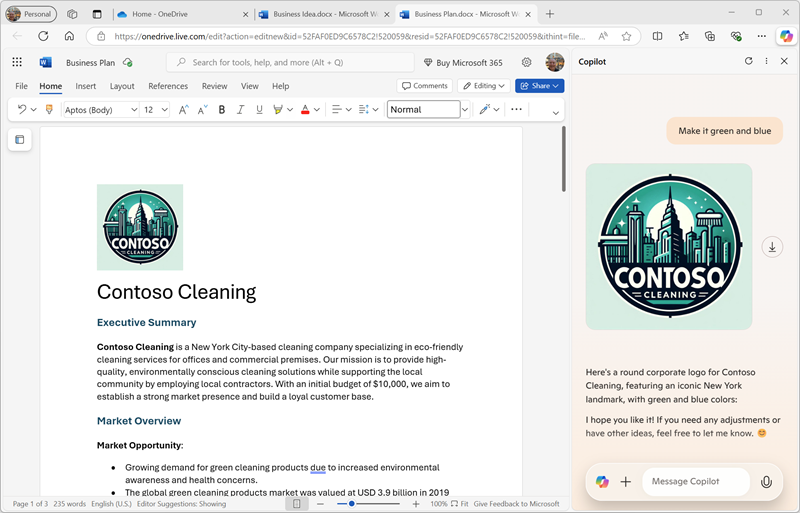

---
lab:
  title: 探索 Microsoft Edge 中的 Copilot
---
# 探索 Microsoft Edge 中的 Microsoft Copilot

在此練習中，您將探索 Microsoft Copilot 在建立新內容時，可以使用產生 AI 來協助您提高生產力的一些方式。 在此練習的案例中，您將從商務構想的一些高階注意事項開始，並在 Microsoft Edge 中使用 Copilot 來協助您開發商務計劃和潛在投資者的簡報。

此練習大約需要 **40** 分鐘才能完成。

> **注意**：本練習假設您有 [個人 Microsoft 帳戶](https://signup.live.com) （例如 outlook.com 帳戶），且您已在計算機上登入 [Microsoft Edge](https://www.microsoft.com/edge/download) 。

## 使用 Copilot 探索檔並研究想法

若要開始探索產生 AI，讓我們在 Edge 中使用 Microsoft Copilot 來檢查現有的檔，並從中擷取一些見解。

1. 在 Microsoft Edge 中，流覽至 [OneDrive`https://onedrive.live.com`](https://onedrive.live.com)，並使用您的個人 Microsoft 帳戶登入 - 關閉任何顯示的歡迎訊息或供應專案。
1. 在另一個瀏覽器索引標籤中，從開啟 Business Idea.docx[`https://github.com/MicrosoftLearning/mslearn-ai-fundamentals/raw/main/data/generative-ai/Business%20Idea.docx`檔](https://github.com/MicrosoftLearning/mslearn-ai-fundamentals/raw/main/data/generative-ai/Business%20Idea.docx)。 然後，當檔在Edge中開啟時，選取 [將複本儲存至 OneDrive] 選項 **，並將檔儲存在 OneDrive** 的 **[檔** ] 資料夾中。 然後，文件應該會自動在 Microsoft Word Online 中開啟。

    > **提示**：如果您沒有看到將檔案復本儲存至 OneDrive 的選項，請將它下載到本機計算機。 然後，在 OneDrive 中**開啟 [檔]** 資料夾，然後使用 [**+ 新增**] 按鈕，將商務Idea.docx**檔案從本機計算機上傳**至 OneDrive。

1. 檢視商務Idea.docx**中的**文字，其中描述紐約市清潔業務的一些高階想法。
1. **使用Edge工具列上的 Copilot 圖示來開啟 Copilot** 窗格，如下所示：

    

1. 在 [Copilot] 窗格中，向下捲動以查看所有必要的內容，並確保已選取 [聊天 **] 索引卷標，並將**交談樣式設定為 **[更平衡**] - 這可確保 Copilot 會以創造力和事實精確度的平衡回應。
1. 在 Copilot 窗格底部的聊天方塊中，輸入下列提示：

    ```
    What is this document about?
    ```

    如果出現提示，請確認您想要允許 Copilot 存取頁面。

1. 檢閱 Copilot 的回應，其應該摘要說明檔中的要點，如下所示：

    

    > **注意**：特定回應可能會有所不同。

1. 輸入下列提示：

    ```
    How do I go about setting up a business in New York?
    ```

1. 檢閱回應，其中包含一些建議和資源連結，以協助您開始在紐約建立業務，並可能包含一些建議的後續提示以取得詳細資訊。

    > **重要**事項：AI 產生的回應是以網路上公開的資訊為基礎。 雖然協助您了解設定業務所需的步驟可能很有用，但並不保證正確 100%，而且不會取代專業建議的需求！

## 使用 Copilot 建立商務方案的內容

既然您已進行過一些初步研究，讓我們讓 Copilot 協助您為清潔公司制定業務計劃。

1. **當商務Idea.docx**檔仍在 Microsoft Edge 中開啟時，在 [Copilot] 窗格中，輸入下列提示：

    ```
    Suggest a name for my cleaning business
    ```

1. 檢閱建議並選取清潔公司的名稱（或繼續提示尋找您想要的名稱）。
1. 輸入下列提示，以 *您選擇的公司名稱取代 Contoso Cleaning* ：

    ```
    Write a business plan for "Contoso Cleaning" based on the information in this document. Include an executive summary, market overview, and financial projections.
    ```

1. 檢閱回應，並在輸出下使用 **複製** （&#128461;） 圖示將它複製到剪貼簿。 然後選取 [商務Ideas.docx**檔中的所有文字**，然後將複製的文字貼到檔中以取代它。 最後，將回應中的初始文字（其中 Copilot 承認指示）取代為清潔公司名稱的標題，以整理貼上的文字。 您應該最後有一份商務方案檔，如下所示：

    

1. 在 [Copilot] 窗格中，輸入下列提示：

    ```
    Create a corporate logo for the cleaning company. The logo should be round and include an iconic New York landmark.
    ```

1. 檢閱回應，其中應該提供 Microsoft Designer 所建立標誌的四個選項。
1. 使用更多提示來反覆運算設計（例如， `Make it green and blue`），直到您擁有您滿意的標誌為止。
1. 以滑鼠右鍵按下您偏好的標誌設計，並將它複製到剪貼簿。 然後將它貼到商務計劃檔的頂端，如下所示：

    

1. 關閉 [Microsoft Word] 索引標籤，並返回 **OneDrive 中的 [檔** ] 資料夾。

## 使用 Copilot 建立簡報的內容

有了科皮洛特的説明，您已為清潔業務構想建立了商務計劃草案。 現在，您將需要一個有效的簡報，以說服投資者提供資金來啟動業務。

1. 在 OneDrive 的 [ **檔]** 資料夾中，新增 PowerPoint **簡報**。

    如果 [設計工具] **** 窗格自動開啟，請關閉它。

1. 在簡報的標題投影片上，輸入清潔公司的名稱做為標題，並 `Investor Opportunity` 做為副標題。
1. 使用 **「兩個內容** 」投影片版面配置新增投影片（其中包含內容的標題和兩個佔位元）。
1. 將投影片標題變更為 `Benefits of Hiring a Commercial Cleaner`。
1. 在 [Copilot] 窗格中，輸入下列提示：

    ```
    Write a summary of the benefits of using a corporate cleaning company for your business. The summary should consist of five short bullet points.
    ```

1. 將 Copilot 的回應複製到剪貼簿，並將它貼到左側內容佔位元中。 然後，刪除確認要求的初始句子，並將佔位元中的文字重新格式化，直到您滿意為止。
1. 在 [Copilot] 窗格中，輸入下列提示：

    ```
    Create a photorealistic image of a clean office.
    ```

1. 當 Copilot 產生您想要的影像時，請將它複製到剪貼簿，並將它貼到投影片右側的內容佔位符中。

    如果 [設計工具****] 窗格自動開啟，請選取您想要的投影片設計。 然後關閉 [ **設計工具** ] 窗格。

1. 套用您認為所需的任何其他重新格式化，直到您有類似以下的投影片：

    

1. 在 PowerPoint 標題列上，選取預設簡報名稱 （**Presentation**），並將它重新命名為 `Business Presentation.pptx`。
1. 關閉 PowerPoint 索引標籤，並返回 **OneDrive 中的 [檔** ] 資料夾。

## 使用 Copilot 撰寫電子郵件

您已建立一些抵押品，以協助您開始業務。 現在是時候與尋求一些創業資金的投資者接觸了。

1. **使用 OneDrive 標題列左端的應用程式啟動器**來開啟 **Outlook**。
1. 建立新的電子郵件，並使用您自己的電子郵件地址填入 **[收** 件者] 方塊。
1. 在 [Copilot] 窗格中，選取 [ **撰寫] 索引標籤** 。然後設定下列選項以撰寫新內容：
    - **寫下**： `Request a meeting with an investment bank to discuss funding for a commercial cleaning business.`
    - **語氣**：專業
    - **格式**：電子郵件
    - **長度**：中
1. 選取 [ **產生草稿**]，然後檢閱產生的輸出。
1. 使用產生的內容來完成您的電子郵件，如下所示：

    

    如果您想要的話，您可以將電子郵件傳送給自己！

## 挑戰

現在您已瞭解如何使用 Copilot 來研究想法併產生內容，為什麼不嘗試進一步探索？ 若要啟動新的 Copilot 會話，請在 **[聊天** ] 索引卷標上，選取 **提示方塊旁的 [新增主題** ] 圖示，然後嘗試使用 Copilot 規劃活動，以在本機圖書館推廣兒童的識字。 您可以嘗試的一些事項包括：

- 研究鼓勵兒童在早期閱讀的一些秘訣。
- 建立事件的傳單或海報。
- 撰寫一封電子郵件，邀請當地兒童作者在活動上發表演講。
- 建立簡報以啟動事件。

盡可能有創造力，並探索 Copilot 如何透過尋找資訊、產生和精簡文字、建立影像和回答問題來協助您。


## 結論

在此練習中，您已使用 Microsoft Edge 中的 Copilot 來尋找資訊併產生內容。 希望您已瞭解如何在 Copilot 中使用產生 AI 來協助提高生產力和創造力。

雖然此練習中使用的免費服務無疑非常強大，但您可以使用適用於 Microsoft 365[ 的 Copilot 等](https://www.microsoft.com/microsoft-365/enterprise/copilot-for-microsoft-365)服務來達成更多目標，其中 Microsoft Copilot 已整合到 Windows 和 Microsoft Office 生產力應用程式中，提供高度內容化的說明，以處理一般工作。 Microsoft 365 可讓您將產生 AI 的強大功能帶入商務數據和程式，同時整合至現有的 IT 基礎結構，以確保可管理且安全的解決方案。